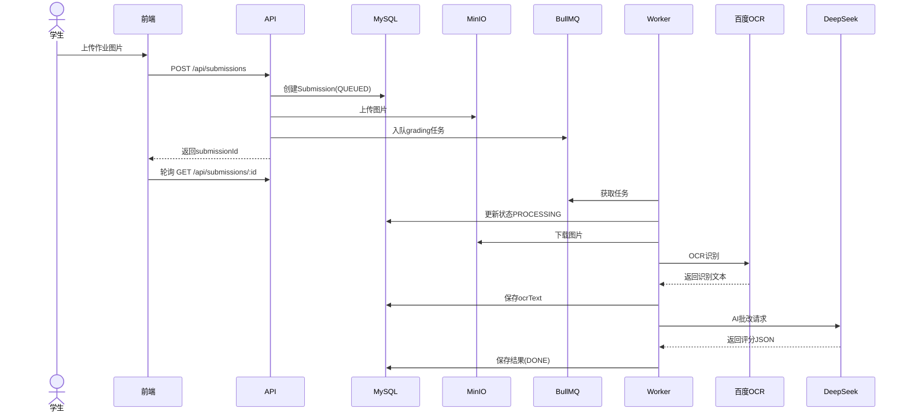

# 架构说明

## 系统架构

Homework AI 采用前后端分离架构，后端使用 NestJS 框架，前端使用 React + Vite。

### 整体架构图

```
┌─────────────────────────────────────────────────────────────────────┐
│                              用户                                   │
└─────────────────────────────────────────────────────────────────────┘
                                 │
                                 ▼
┌─────────────────────────────────────────────────────────────────────┐
│                        Nginx (端口80)                               │
│  ┌─────────────────────────────────────────────────────────────┐   │
│  │  /            ──►  host.docker.internal:3001 (前端)         │   │
│  │  /api/*       ──►  host.docker.internal:3008 (后端API)      │   │
│  └─────────────────────────────────────────────────────────────┘   │
└─────────────────────────────────────────────────────────────────────┘
                                 │
                ┌────────────────┴────────────────┐
                ▼                                 ▼
┌───────────────────────────┐     ┌─────────────────────────────────┐
│   Frontend (端口3001)      │     │   Backend API (端口3008)        │
│   React + Vite + AntD     │     │   NestJS                        │
└───────────────────────────┘     │   ├─ Auth (JWT)                 │
                                 │   ├─ Classes                     │
                                 │   ├─ Homeworks                   │
                                 │   ├─ Submissions                 │
                                 │   ├─ Reports                     │
                                 │   └─ Admin                       │
                                 └─────────────────────────────────┘
                                                   │
                    ┌──────────────────────────────┼──────────────────┐
                    ▼                              ▼                  ▼
          ┌─────────────────┐         ┌──────────────────┐  ┌─────────────┐
          │  MySQL (3306)   │         │  Redis (6379)    │  │  MinIO      │
          │  Prisma ORM     │         │  BullMQ Queue    │  │  (9000)     │
          └─────────────────┘         └──────────────────┘  └─────────────┘
                                                    │
                                                    ▼
                                  ┌─────────────────────────────────────┐
                                  │  Worker Process                     │
                                  │  ├─ 下载图片 (MinIO)                │
                                  │  ├─ 百度OCR识别                     │
                                  │  ├─ DeepSeek LLM批改                │
                                  │  └─ 保存结果 (MySQL)                │
                                  └─────────────────────────────────────┘
```

## 核心模块

### 后端模块 (`apps/backend/src/`)

| 模块 | 路径 | 功能 |
|------|------|------|
| Auth | `auth/` | JWT认证、角色守卫 |
| Admin | `admin/` | 系统配置、队列管理 |
| Classes | `classes/` | 班级管理、学生导入 |
| Homeworks | `homeworks/` | 作业创建、查询 |
| Submissions | `submissions/` | 作业提交、图片上传 |
| Grading | `grading/` | AI批改服务 |
| OCR | `ocr/` | 百度OCR集成 |
| Queue | `queue/` | BullMQ队列管理 |
| Reports | `reports/` | 报表生成、CSV导出 |
| Retention | `retention/` | 数据清理 |
| Storage | `storage/` | MinIO对象存储 |
| Worker | `worker/` | 后台批改任务处理 |

### 前端模块 (`apps/frontend/src/`)

| 模块 | 路径 | 功能 |
|------|------|------|
| Pages | `pages/` | 各角色页面组件 |
| API | `api/` | API请求封装 |
| Routes | `routes/` | 路由配置 |
| Components | `components/` | 通用组件 |

## 数据流

### 提交批改流程



### 状态机

```
                    ┌─────────────┐
                    │   QUEUED    │  提交后初始状态
                    └──────┬──────┘
                           │
                    Worker开始处理
                           ▼
                    ┌─────────────┐
                    │ PROCESSING  │  OCR + LLM处理中
                    └──────┬──────┘
                           │
            ┌──────────────┴──────────────┐
            ▼                             ▼
       ┌─────────┐                   ┌─────────┐
       │  DONE   │                   │ FAILED  │
       └─────────┘                   └─────────┘
    处理成功                       处理失败
```

## 数据模型

### 核心实体

```typescript
User          // 用户: account, name, role(STUDENT/TEACHER/ADMIN)
Class         // 班级: name, grade
Enrollment    // 关联: userId, classId
Homework      // 作业: title, content, dueDate, classId
Submission    // 提交: status, ocrText, gradingJson, totalScore
SubmissionImage // 提交图片: objectKey
SystemConfig  // 系统配置: key, value
```

## 部署架构

### Docker服务

| 服务 | 端口映射 | 功能 |
|------|----------|------|
| mysql | 3306 | 数据库 |
| redis | 6379 | 队列、缓存 |
| minio | 9000-9001 | 对象存储 |
| nginx | 80 | 反向代理 |

### 本地开发服务

| 服务 | 端口 | 功能 |
|------|------|------|
| Frontend Dev Server | 3001 | Vite开发服务器 |
| Backend API | 3008 | NestJS API |
| Worker | - | 后台任务处理 |

## 技术选型理由

| 技术 | 选型 | 理由 |
|------|------|------|
| 后端框架 | NestJS | 企业级Node.js框架，模块化设计 |
| ORM | Prisma | 类型安全，迁移管理 |
| 队列 | BullMQ | Redis支持的可靠任务队列 |
| 前端框架 | React | 生态丰富 |
| 构建工具 | Vite | 快速开发体验 |
| UI组件 | Ant Design | 企业级UI组件库 |
| OCR | 百度OCR | 准确率高，国内稳定 |
| LLM | DeepSeek | 成本低，中文支持好 |
| 存储 | MinIO | S3兼容，可私有化部署 |
